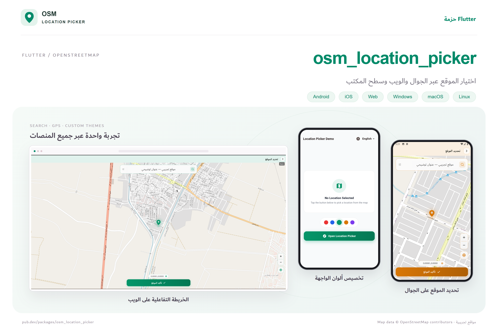
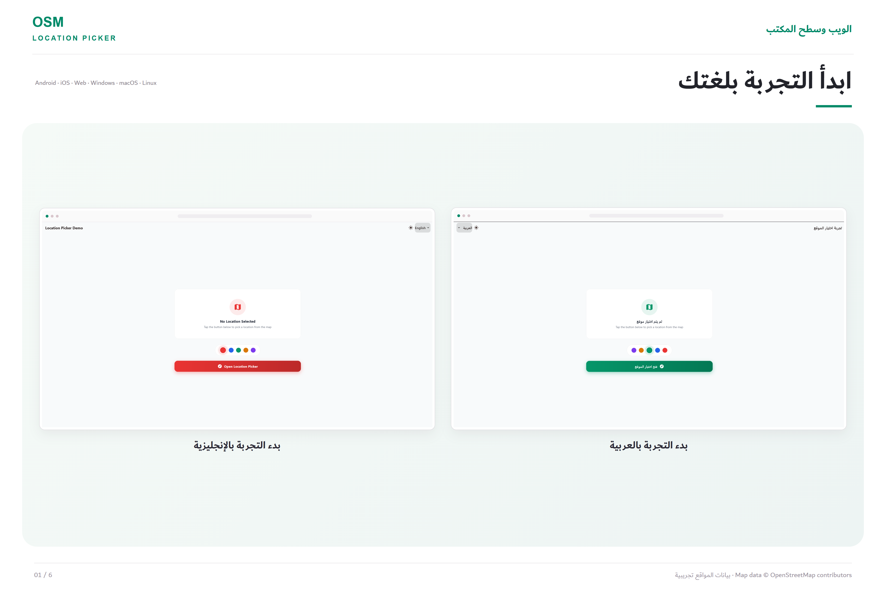
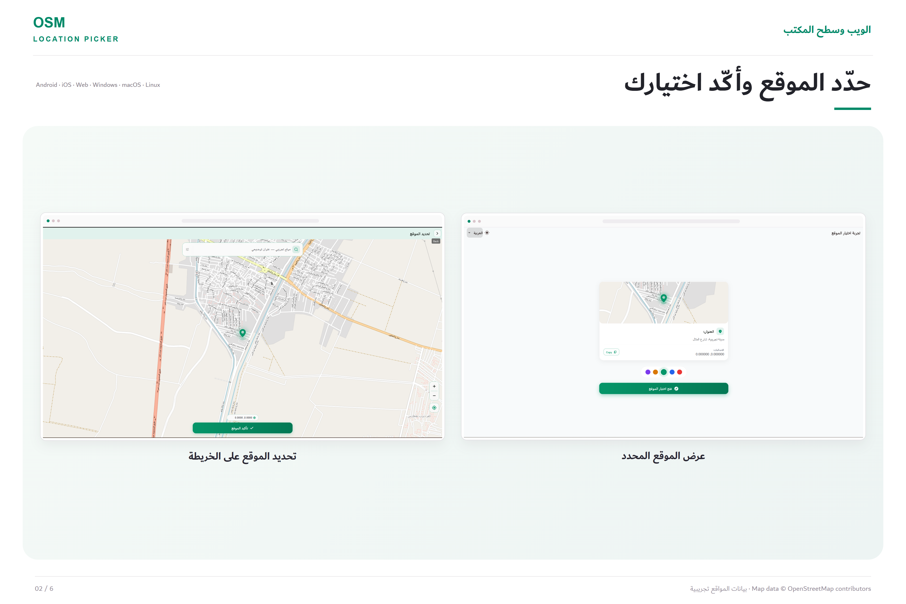
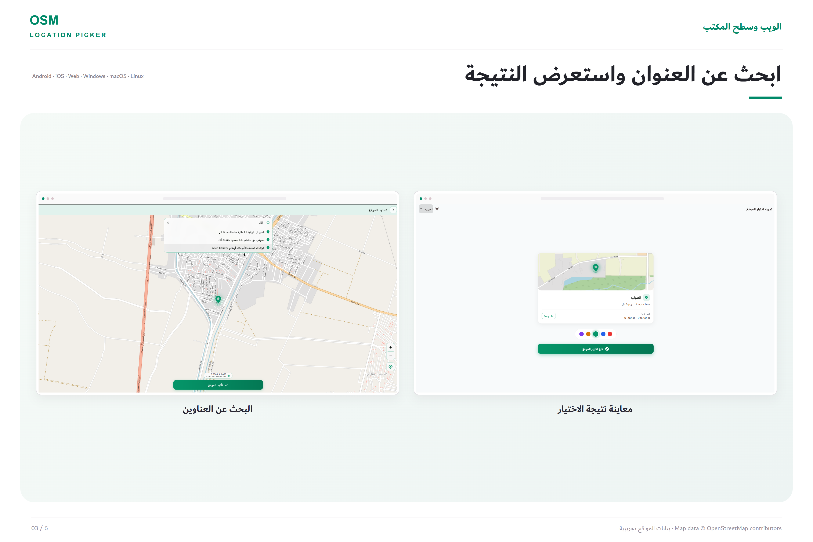
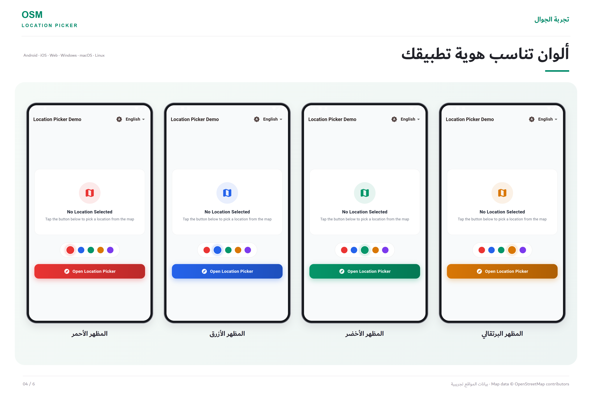
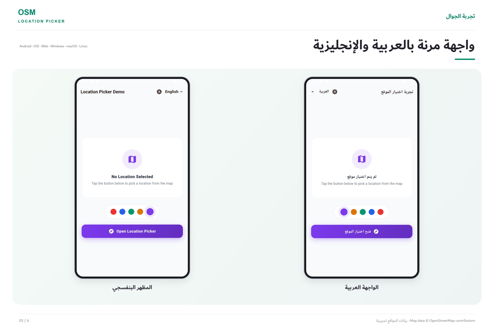
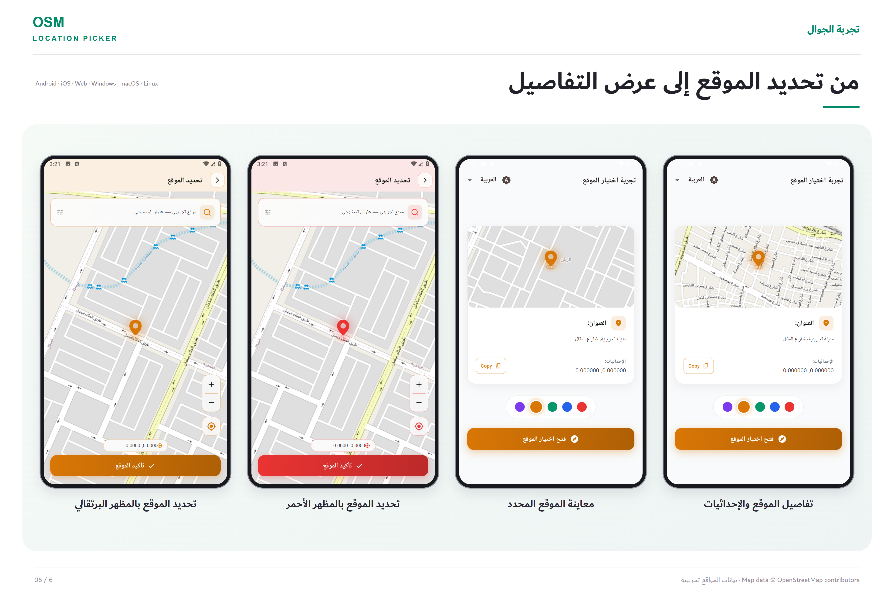

# osm_location_picker

[](https://pub.dev/packages/osm_location_picker)
[](https://pub.dev/packages/osm_location_picker/score)
[](https://flutter.dev/)
[](https://dart.dev/web/wasm)
[](https://flutter.dev/multi-platform)
[](https://github.com/ahmedalam782/osm_location_picker/blob/main/LICENSE)

A creative, modern, and highly customizable Flutter location picker powered by [OpenStreetMap](https://www.openstreetmap.org/) and [Nominatim](https://nominatim.org/).

> **No API key. No account. No billing.**
> Everything runs on free, open-source map and geocoding services. Say goodbye to Google Maps Cloud console setups, billing credit cards, and unexpected API costs. Great for **prototypes, indie apps, and small to medium production apps**.

> **Using this in production?** The public OpenStreetMap tile servers and Nominatim are shared community services with [usage policies](https://operations.osmfoundation.org/policies/tiles). They're ideal for prototypes and small apps. For apps with significant traffic, point `tileUrlTemplate` at your own or a commercial tile provider, and use your own geocoder via `LocationPickerDependencies.placeSearch`.

<p align="center">
  
</p>

---

## 📑 Table of Contents

- [Screenshots & Showcase](#-screenshots--showcase)
- [Features](#-features)
- [Why osm_location_picker?](#-why-osm_location_picker)
- [Platform Support](#-platform-support)
- [Platform Permissions & Setup](#-platform-permissions--setup)
- [Quick Start](#-quick-start)
  - [1. Full-Screen Page Mode](#1-full-screen-page-mode)
  - [2. Inline Embeddable Widget Mode](#2-inline-embeddable-widget-mode)
  - [3. Pre-filling / Restoring Selected Location](#3-pre-filling--restoring-selected-location)
- [Theming & Glassmorphism](#-theming--glassmorphism)
  - [Quick Theme from Accent Color](#quick-theme-from-accent-color)
  - [Adaptive Dark & Light Mode (`forBrightness`)](#adaptive-dark--light-mode-forbrightness)
  - [Ambient App Theme Inheritance (`LocationPickerTheme.of`)](#ambient-app-theme-inheritance-locationpickerthemeof)
  - [Lottie Animations](#lottie-animations)
- [Custom Icons (`LocationPickerIcon`)](#-custom-icons-locationpickericon)
- [Static Map Preview (`LocationMapPreview`)](#-static-map-preview-locationmappreview)
- [Configuration (`LocationPickerConfig`)](#-configuration-locationpickerconfig)
- [Localization & Arabic RTL Support](#-localization--arabic-rtl-support)
- [Architecture & Testing (`LocationPickerDependencies`)](#-architecture--testing-locationpickerdependencies)
- [API Reference](#-api-reference)
- [بالعربي (Arabic Guide)](#-بالعربي)
- [License & Attributions](#-license--attributions)

---

## 📸 Screenshots & Showcase

| 🌐 Web & Desktop Experience | 🗺️ Map Selection & Confirmation |
| :---: | :---: |
|  |  |

| 🔍 Live Search & Autocomplete | 🎨 Custom Color Themes & Branding |
| :---: | :---: |
|  |  |

| 📱 Multilingual & Responsive UI | 📍 End-to-End Selection Flow |
| :---: | :---: |
|  |  |

---

## ✨ Features

- 💎 **Modern Frosted Glassmorphism**: Translucent floating cards with blur effects, adaptive shadows, and sleek borders.
- 🎯 **Interactive 3D Radar Pin**: Animated center marker with landing contact shadow, drag physics, and precision crosshair dot.
- 🕹️ **Floating Control Dock**: Clean docked actions for **Zoom In (+)**, **Zoom Out (-)**, and **My Location** with desktop hover effects.
- 📋 **Copyable Coordinates Pill**: One-tap interactive badge displaying formatted latitude & longitude with clipboard copy confirmation.
- 🔍 **Address Search**: Nominatim-powered search bar with keyboard shortcuts (<kbd>Escape</kbd> to close, <kbd>Arrow</kbd> keys to navigate). Swap in your own geocoder for heavy usage.
- 🌓 **Instant Dark Mode (`forBrightness`)**: Seamlessly adapt any custom color scheme to dark mode or light mode on the fly with `.forBrightness(Brightness.dark)`.
- 🎨 **100% Customizable Icons & Colors**: Swap any icon using Material icons, SVG assets, PNGs, Network images, or raw SVG markup.
- 🖼️ **Static Map Thumbnail (`LocationMapPreview`)**: Display selected locations on order summaries or user profile screens with dark mode support.
- 🔄 **Safe Auto-Persistence**: Tapping the Back button automatically preserves the currently selected location so user input is never lost.
- 🌍 **Native RTL & Multi-Language Support**: Correct address component ordering for RTL languages (such as Arabic) with properly formatted LTR coordinates.
- 🧪 **Enterprise Testability**: Built with dependency injection (`LocationPickerDependencies`) for mockable GPS, geocoding, and offline testing.

---

## 💡 Why osm_location_picker?

| Feature | `osm_location_picker` | Google Maps Based Pickers |
| :--- | :--- | :--- |
| **API Key Required** | ❌ **No** | ✅ Yes (Mandatory) |
| **Credit Card / Billing** | ❌ **No** | ✅ Required in Google Cloud |
| **Setup & Cost** | ⚡ No key, no billing account | ⏳ Cloud project, API keys, billing |
| **Map Engine** | 🗺️ OpenStreetMap & Flutter Map | 🏢 Proprietary Google Maps SDK |
| **Styling & Theming** | 🎨 Full control (Glassmorphism, Dark Mode, SVG icons) | ⚠️ Limited to Google Maps styling JSON |

---

## 📱 Platform Support

| Platform | Support | Requirements & Details |
| :--- | :---: | :--- |
| **Android** | ✅ | Requires `INTERNET` and location permissions (see below). |
| **iOS** | ✅ | Requires location permission descriptions in `Info.plist`. |
| **macOS** | ✅ | App Sandbox location & network client entitlements required. |
| **Web** | ✅ | Full support for both **JavaScript** & **WebAssembly (WASM)** via `flutter build web --wasm`. **HTTPS required** in production for Geolocation. |
| **Windows** | ✅ | Full support with mouse hover states and keyboard navigation. |
| **Linux** | ✅ | Full support with mouse hover states and keyboard navigation. |

> **Note:** GPS utilizes [`geolocator`](https://pub.dev/packages/geolocator). If location services are disabled or denied, the picker gracefully falls back to the configured default center, allowing users to search or pan manually.

---

## 🔐 Platform Permissions & Setup

### Android

Add the required permissions to `android/app/src/main/AndroidManifest.xml`, before the `<application>` tag:

```xml
<!-- Internet & network state for map tiles and geocoding -->
<uses-permission android:name="android.permission.INTERNET"/>
<uses-permission android:name="android.permission.ACCESS_NETWORK_STATE"/>

<!-- GPS & location -->
<uses-permission android:name="android.permission.ACCESS_FINE_LOCATION"/>
<uses-permission android:name="android.permission.ACCESS_COARSE_LOCATION"/>
```

> **Release builds:** both `INTERNET` and `ACCESS_NETWORK_STATE` are required. The package checks connectivity before loading tiles and running searches. All map and geocoding requests use HTTPS, so no cleartext or network security configuration is needed.

---

### iOS

1. Add location permission descriptions to `ios/Runner/Info.plist`:

```xml
<key>NSLocationWhenInUseUsageDescription</key>
<string>This app needs access to your location to show it on the map.</string>
<key>NSLocationAlwaysAndWhenInUseUsageDescription</key>
<string>This app needs access to your location to show it on the map.</string>
```

> [!TIP]
> **Testing on the iOS Simulator:**
> In the iOS Simulator, the location is set to **None** by default. To simulate GPS:
> - In Simulator menu bar: **Features** → **Location** → Choose **Apple** or **Custom Location...**
> - Or run in terminal: `xcrun simctl location booted set 37.7749,-122.4194`

---

### macOS

1. In `macos/Podfile`, ensure the deployment target is at least `12.0`:
```ruby
platform :osx, '12.0'
```

2. In `macos/Runner/Info.plist`, add:
```xml
<key>NSLocationUsageDescription</key>
<string>This app needs access to your location to show it on the map.</string>
<key>NSLocationWhenInUseUsageDescription</key>
<string>This app needs access to your location to show it on the map.</string>
<key>NSLocationAlwaysAndWhenInUseUsageDescription</key>
<string>This app needs access to your location to show it on the map.</string>
```

3. In both `macos/Runner/DebugProfile.entitlements` and `macos/Runner/Release.entitlements`, add network and location sandbox entitlements:
```xml
<key>com.apple.security.network.client</key>
<true/>
<key>com.apple.security.personal-information.location</key>
<true/>
```

---

### Web (JavaScript & WebAssembly / WASM)

- **WebAssembly (WASM) Ready**: Fully compatible with `flutter build web --wasm` (uses modern standard browser APIs with zero deprecated `dart:html` or `dart:io` imports).
- No configuration files are required. The browser will prompt the user automatically for geolocation permissions via the standard Geolocation API.
- Modern browsers require **HTTPS** in production to grant geolocation access (`http://localhost` is allowed for local development).

> [!TIP]
> **OpenStreetMap Tile Usage on Web / Localhost:**
> When debugging on Chrome (`localhost`), OpenStreetMap's public servers can rate-limit or block requests (`403 Forbidden` / `ClientException: Failed to fetch`) if using generic package names like `com.example.*`. Always use a unique `userAgentPackageName` (e.g. `'org.my_company.my_app'`) and provide a `fallbackUrl` (such as `'https://tile.openstreetmap.fr/osmfr/{z}/{x}/{y}.png'`) in your `LocationPickerConfig` for guaranteed tile availability.

---

### Windows & Linux

- No extra permissions required.
- Internet connectivity is used for map tiles and reverse geocoding.
- If GPS / system location service is unavailable on the desktop environment, the picker gracefully centers on `fallbackCenter` (configurable in `LocationPickerConfig`).

---

## 🚀 Quick Start

Add the dependency to your `pubspec.yaml`:

```yaml
dependencies:
  osm_location_picker: ^1.0.5
```

### 1. Full-Screen Page Mode

Push `LocationPickerView` onto the navigation stack. It returns a `LocationModel?` when the user confirms or presses back:

```dart
import 'package:osm_location_picker/osm_location_picker.dart';

final LocationModel? result = await Navigator.of(context).push<LocationModel>(
  MaterialPageRoute(
    builder: (context) => const LocationPickerView(),
  ),
);

if (result != null) {
  print('Address: ${result.address}');
  print('Latitude: ${result.latLng?.latitude}');
  print('Longitude: ${result.latLng?.longitude}');
}
```

### 2. Inline Embeddable Widget Mode

Embed the picker directly within your screen, custom sheet, or drawer:

```dart
SizedBox(
  height: 400,
  child: LocationPickerView.widget(
    initialLatLng: LatLng(30.0444, 31.2357),
    onConfirmed: (LocationModel location) {
      print('Selected: ${location.address}');
    },
  ),
)
```

### 3. Pre-filling / Restoring Selected Location

Open the picker centered on an existing location:

```dart
LocationPickerView(
  initialLatLng: LatLng(30.044420, 31.235712),
  initialAddress: 'Tahrir Square, Cairo, Egypt',
)
```

---

## 🎨 Theming & Glassmorphism

### Quick Theme from Accent Color

Generate a coherent, beautiful color scheme automatically using `LocationPickerTheme.fromPrimary`:

```dart
LocationPickerView(
  theme: LocationPickerTheme.fromPrimary(
    const Color(0xff2563EB), // Royal Blue accent
    glassmorphism: true,     // Frosted blur effect
    borderRadius: 18.0,      // Card radius
    accentGradient: const LinearGradient(
      colors: [Color(0xff2563EB), Color(0xff1D4ED8)],
    ),
  ),
)
```

### Adaptive Dark & Light Mode (`forBrightness`)

Adapt any theme instantly for dark mode while keeping your custom accent colors and icons:

```dart
final baseTheme = LocationPickerTheme.fromPrimary(const Color(0xff059669));

// Automatically converts cards, backgrounds, and borders to dark surfaces:
final darkTheme = baseTheme.forBrightness(Brightness.dark);

LocationPickerView(
  theme: isDarkMode ? darkTheme : baseTheme,
)
```

### Ambient App Theme Inheritance (`LocationPickerTheme.of`)

Derive colors automatically from your app's ambient `ThemeData`:

```dart
LocationPickerView(
  theme: LocationPickerTheme.of(context),
)
```

### Lottie Animations

Replace the default progress indicators and error views with custom Lottie animations:

```dart
LocationPickerTheme(
  loadingLottieAsset: 'assets/lottie/map_loading.json',
  errorLottieAsset: 'assets/lottie/map_error.json',
  noInternetLottieAsset: 'assets/lottie/offline.json',
)
```

---

## 🎭 Custom Icons (`LocationPickerIcon`)

Every icon in the picker can be replaced using `LocationPickerIcon`. Five flexible constructors are supported:

| Constructor | Description |
| :--- | :--- |
| `LocationPickerIcon.icon(IconData)` | Material or Cupertino icons |
| `LocationPickerIcon.svg('assets/pin.svg')` | Local SVG asset |
| `LocationPickerIcon.asset('assets/pin.png')` | Local bitmap asset (PNG/JPEG) |
| `LocationPickerIcon.network('https://...')` | Remote image URL |
| `LocationPickerIcon.markup('<svg>...</svg>')` | Inlined raw SVG string |

```dart
LocationPickerTheme(
  pinIcon: const LocationPickerIcon.icon(Icons.location_pin, size: 48),
  searchIcon: const LocationPickerIcon.svg('assets/icons/search.svg'),
  myLocationIcon: const LocationPickerIcon.icon(Icons.gps_fixed),
  confirmIcon: const LocationPickerIcon.icon(Icons.check_rounded),
  zoomInIcon: const LocationPickerIcon.icon(Icons.add_rounded),
  zoomOutIcon: const LocationPickerIcon.icon(Icons.remove_rounded),
  backIcon: const LocationPickerIcon.icon(Icons.arrow_back_ios_new_rounded),
)
```

---

## 🖼️ Static Map Preview (`LocationMapPreview`)

Show a clean map thumbnail on order confirmation cards, checkout pages, or user profiles after a location has been picked:

```dart
if (selectedLocation?.latLng != null)
  LocationMapPreview(
    location: selectedLocation!.latLng!,
    height: 190,
    zoom: 16.0,
    borderRadius: BorderRadius.circular(16),
    showPin: true,
    theme: LocationPickerTheme.fromPrimary(Theme.of(context).primaryColor),
  )
```

**Key Advantages:**
- Pin color stays vibrant and is not inverted by dark mode filters.
- Features ground contact shadow and target coordinates dot.
- Automatically re-centers when the location changes.

---

## ⚙️ Configuration (`LocationPickerConfig`)

Control map tiles, user-agents, search parameters, and tile brightness:

```dart
LocationPickerView(
  config: LocationPickerConfig(
    acceptLanguage: 'ar',                             // Nominatim language code
    initialZoom: 16.0,                                // Initial map zoom level
    maxZoom: 18.0,                                    // Max map zoom limit
    fallbackCenter: LatLng(30.0444, 31.2357),         // Used if GPS is denied
    searchLimit: 6,                                   // Max search results
    nominatimUserAgent: 'MyCoolApp/1.0',              // Required by Nominatim policy
    userAgentPackageName: 'org.my_company.my_app',    // Tile request identifier
    fallbackUrl: 'https://tile.openstreetmap.fr/osmfr/{z}/{x}/{y}.png', // Optional tile fallback
    useDarkTiles: null,                               // null = auto, true = dark, false = light
  ),
)
```

---

## 🌐 Localization & Arabic RTL Support

Customize every text string via `LocationPickerStrings`. The picker natively mirrors layouts for RTL languages like Arabic and reverses address strings correctly while maintaining clean LTR coordinate displays:

```dart
LocationPickerView(
  config: const LocationPickerConfig(acceptLanguage: 'ar'),
  strings: const LocationPickerStrings(
    title: 'تحديد الموقع',
    confirmLocation: 'تأكيد الموقع',
    currentLocation: 'موقعي الحالي',
    searchHint: 'ابحث عن اسم الشارع أو المنطقة...',
    fetchingLocation: 'جاري جلب العنوان...',
    locationFetchFailed: 'فشل جلب الموقع',
    noInternet: 'لا يوجد اتصال بالإنترنت',
    serviceDisabled: 'خدمات الموقع معطلة',
    permissionDenied: 'تم رفض إذن الوصول للموقع',
    permissionPermanentlyDenied: 'تم رفض إذن الموقع بشكل دائم',
    noResults: 'لا توجد نتائج بحث',
    unknownLocation: 'موقع غير معروف',
  ),
)
```

---

## 🧪 Architecture & Testing (`LocationPickerDependencies`)

`osm_location_picker` is architected with clean architecture and explicit dependency injection. This makes unit testing and custom backend integration effortless:

```dart
class MockDeviceLocation implements DeviceLocation {
  @override
  Future<LatLng?> determinePosition() async => const LatLng(30.0444, 31.2357);
}

LocationPickerView(
  dependencies: LocationPickerDependencies(
    deviceLocation: MockDeviceLocation(),
    addressLookup: myCustomAddressLookup,
    networkStatus: myNetworkStatusChecker,
    placeSearch: myCustomPlaceSearch,
  ),
)
```

---

## 📋 API Reference

### `LocationModel`

| Field | Type | Description |
| :--- | :--- | :--- |
| `address` | `String?` | Reverse-geocoded address string from Nominatim |
| `latLng` | `LatLng?` | Coordinate point (`latitude`, `longitude`) |
| `toJson()` | `Map<String, dynamic>` | Serializes model to JSON map |
| `LocationModel.fromJson(json)` | Factory | Deserializes model from JSON map |

### `LocationPickerConfig`

| Field | Type | Default | Description |
| :--- | :--- | :--- | :--- |
| `tileUrlTemplate` | `String` | OpenStreetMap standard | Raster map tile template |
| `tileSubdomains` | `List<String>` | `[]` | Tile server subdomains |
| `userAgentPackageName` | `String` | `'com.location_picker.app'` | Package identifier for tile headers |
| `nominatimUserAgent` | `String` | `'LocationPicker/1.0'` | User-agent sent to Nominatim |
| `acceptLanguage` | `String` | `'en'` | Desired geocoding language code |
| `initialZoom` | `double` | `16.0` | Initial zoom level |
| `maxZoom` | `double` | `18.0` | Maximum zoom level |
| `fallbackCenter` | `LatLng` | `(33.3152, 44.3661)` | Default position if GPS is unavailable |
| `searchLimit` | `int` | `5` | Maximum search results returned |
| `fallbackUrl` | `String?` | `null` | Optional backup tile server if primary is blocked or slow |
| `useDarkTiles` | `bool?` | `null` | `true` for dark tiles, `false` for light, `null` for auto |
| `showSearch` | `bool` | `true` | Show or hide the search bar and search icon |
| `showAddressHeader` | `bool` | `true` | Show or hide the top address card |
| `showMyLocationButton` | `bool` | `true` | Show or hide the floating "My Location" GPS button |
| `showZoomControls` | `bool` | `true` | Show or hide the floating zoom (+ / -) buttons |
| `showConfirmButton` | `bool` | `true` | Show or hide the bottom confirm location button |
| `autoFetchCurrentLocation` | `bool` | `true` | Automatically fetch device GPS on startup if coordinates are null |

---

## 🇸🇦 بالعربي

**منتقي مواقع عصري، متكامل واحترافي لتطبيقات فلاتر (Flutter) مبني بالكامل على خرائط OpenStreetMap وخدمة البحث الجغرافي Nominatim. بدون الحاجة لحساب Google Cloud، بدون API Key، وبدون أي فواتير أو بطاقات بنكية.**

المستخدم يمكنه تصفح الخريطة، البحث عن أي عنوان، وتأكيد موقعه بنقرة واحدة، لتقوم الحزمة بإرجاع كائن `LocationModel` يحتوي على العنوان النصي والإحداثيات الجغرافية الدقيقة.

> **ملاحظة للتطبيقات الإنتاجية:** خوادم الخرائط العامة لـ OpenStreetMap وخدمة Nominatim مخصصة للمشاريع الصغيرة والتجارب. للتطبيقات ذات الاستخدام الكبير، استخدم مزوّد خرائط خاص بك عبر `tileUrlTemplate`.

### المميزات الرئيسية:
- 🎨 **تصميم زجاجي فاخر (Glassmorphism)**: واجهات شفافة أنيقة مع تأثير التمويه (Blur) وظلال عصرية ناعمة.
- 📍 **مؤشر رادار ثلاثي الأبعاد**: دبوس خريطة مميز مع ظل ملامس للأرض ونقطة تصويب دقيقة مع حركة واقعية عند السحب.
- 🕹️ **منصة تحكم عائمة**: أزرار التقريب والتصغير وموقعي الحالي بتصميم موحد وتأثيرات تمرير (Hover) على سطح المكتب.
- 📋 **شريحة نسخ الإحداثيات**: زر مدمج لنسخ خط الطول والعرض بنقرة واحدة مع إشعار تأكيد النسخ.
- 🌓 **تحويل فوري للوضع الليلي (`forBrightness`)**: تبديل مباشر للألوان لتلائم الوضع الداكن دون فقدان لون الهوية الخاص بك.
- 🔍 **بحث عن العناوين مع اختصارات لوحة المفاتيح**: يدعم الإغلاق بمفتاح <kbd>Escape</kbd> والتنقل بالأسهم على الويب وسطح المكتب.
- 🖼️ **معاينة مصغرة للموقع (`LocationMapPreview`)**: بطاقة خريطة مصغرة جاهزة لعرض الموقع المختار في شاشات تأكيد الطلبات أو الملف الشخصي.
- 🌐 **دعم كامل للغة العربية والاتجاه من اليمين لليسار (RTL)**: صياغة صحيحة لعناصر العناوين العربية وتنسيق الإحداثيات الإنجليزية بدقة.
- ⚡ **دعم كامل لتقنية WebAssembly (WASM)**: يعمل بكفاءة وأداء عالي على الويب عند التجميع بواسطة `flutter build web --wasm`.
- 🔄 **حفظ تلقائي عند الرجوع**: لا تفقد بيانات الموقع عند الضغط على زر العودة.

### كود الاستخدام السريع:

```dart
final LocationModel? result = await Navigator.of(context).push<LocationModel>(
  MaterialPageRoute(
    builder: (context) => LocationPickerView(
      config: const LocationPickerConfig(
        acceptLanguage: 'ar',
        userAgentPackageName: 'org.my_company.my_app',
      ),
      strings: const LocationPickerStrings(
        title: 'تحديد موقع التوصيل',
        confirmLocation: 'تأكيد هذا الموقع',
        currentLocation: 'موقعي الحالي',
        searchHint: 'ابحث عن اسم الشارع أو المعلم...',
        fetchingLocation: 'جاري جلب العنوان...',
      ),
      theme: LocationPickerTheme.fromPrimary(
        const Color(0xff059669), // أخضر زمردي
        glassmorphism: true,
        borderRadius: 16.0,
      ),
    ),
  ),
);

if (result != null) {
  print(result.address);
  print('${result.latLng?.latitude}, ${result.latLng?.longitude}');
}
```

---

## 📄 License & Attributions

- Distributed under the **MIT License**. See [LICENSE](https://github.com/ahmedalam782/osm_location_picker/blob/main/LICENSE) for details.
- Map tiles © [OpenStreetMap contributors](https://www.openstreetmap.org/copyright). Please review the [OSM Tile Usage Policy](https://operations.osmfoundation.org/policies/tiles).
- Geocoding and reverse search provided by [Nominatim](https://nominatim.org/). Please respect the [Nominatim Usage Policy](https://operations.osmfoundation.org/policies/nominatim/).
- Found a bug or need a new feature? Feel free to open an issue or pull request on [GitHub](https://github.com/ahmedalam782/osm_location_picker).